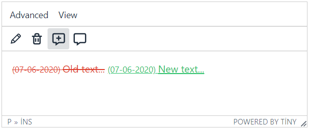
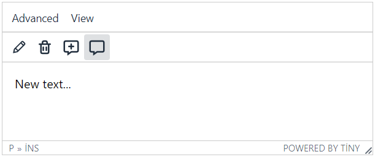

# TinyMCE5-Track-Changes
TinyMCE 5 WYSIWYG editöründe sayfaya yeni eklenmiş metinler Advanced(Gelişmiş) menüsü altında bulunan Formats(Biçimler) menüsü içerisinden Inserted(Eklenmiş) biçimi seçilerek işaretlenebilir veya silinmeye karar verilmiş metinler Deleted(Silinmiş) biçimi seçilerek işaretlenebilir. İşaretlemeler aktif hale getirildiğinde yada kaydedildiğinde silinmiş metinler gözükmeyecektir. Track Changes(Değişiklikleri İzleme) işlemi için &lt;ins datetime=""&gt; ve &lt;del datetime=""&gt; HTML elementleri kullanılmıştır.

Türkçe kullanabilmek için dil dosyasının sonuna aşağıdaki satırları ekleyebilirsiniz:

```
"Inserted Text": "Eklenmi\u015f Metin",
"Deleted Text": "Silinmi\u015f Metin",
"Changes": "De\u011fi\u015fiklikler",
"Show Changes": "De\u011fi\u015fiklikleri G\u00f6ster",
"Hide Changes": "De\u011fi\u015fiklikleri Gizle",
```

trackchanges.js dosyasını indirip aşağıdaki şekilde kaydedebilirsiniz:

```
<!DOCTYPE html>
<html lang="tr" >
<head>
  <meta charset="utf-8" />
  <meta name="viewport" content="width=device-width, initial-scale=1.0" />

  <script src="https://.../tinymce/5/tinymce.min.js" ></script> <!-- use tinymce actual version. -->
  
  <script>
  tinymce.init({
  selector: "textarea",  // change this value according to your HTML.

  plugins: [
    "code trackchanges",
  ],

  toolbar: "inserttext deletetext showchanges hidechanges",

  menubar: "advanced view",

  menu: {
    advanced: { title: "Advanced", items: "trackchanges" },
    view: { title: "View", items: "code" }, // I add this to show the codes.
  },
  });
  </script>
  
  <script src="trackchanges.js"></script> <!-- save plugin here -->

</head>
<body>

  <form method="post">
    <textarea>metin...</textarea>
  </form>

</body>
</html>
```
## Biçimlendirmeyi İşaretle:

## Biçimlendirmeyi Göster:

## Biçimlendirmeyi Gizle:

## Kaydedilen metnin kaynak kodları:


